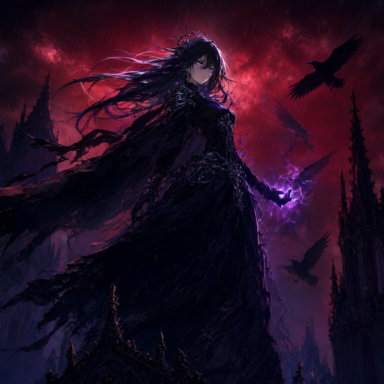
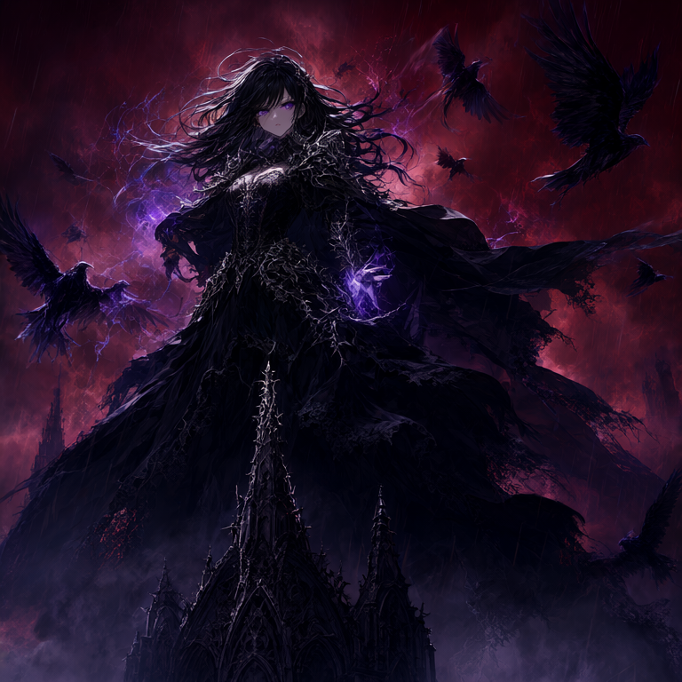
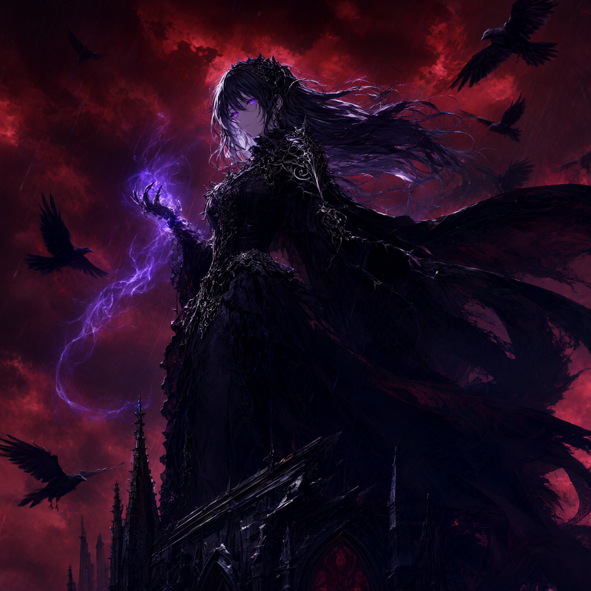

# Qwen Image 2.1

This is a Rust implementation of the [Qwen Image 2.1](https://huggingface.co/Qwen/Qwen-Image-2.1) which currently sits at Rank 1 of [Text-to-Image Arena](https://arena.ai/leaderboard/text-to-image?license=open-source) in Open Source category as of 04/10/26.

#### Sample Generation: 

<table>
  <tr>
    <td></td>
    <td></td>
    <td></td>
  </tr>
</table>

## Features
- Full BF16 weights for high fidelity generation
- RAM Layer Streaming for Low VRAM usage

## Speed Test

| Resolution | Batch Size | Time Taken | Peak VRAM
| --- | --- | --- | --- |
| 512 x 512 | 1 | 74 sec | ~2.2 GB
| 768 x 768 | 1 | 115 sec | ~4.2 GB
| 1024 x 1024 | 1 | 187 sec  | ~5.2 GB
| 512 x 512 | 4 | 176 sec | ~6.2 GB

#### Tested on an RTX 4060Ti 8GB w/ 25 steps.

## Components
- DiT (Completed)
- VAE (TODO)
- Text Encoder (TODO)

## Flash Attention
Flash attention doesn't require materializing full N x N matrix hence saving us a lot of VRAM.

#### 1024x1024 Image generated utilizing only ~5.2GB peak VRAM.

## License

Code distributed under MIT license. 
 
Weights are under [qwen-research license](https://huggingface.co/Qwen/Qwen-Image-2.1/blob/main/LICENSE) and not distributed with the repo.