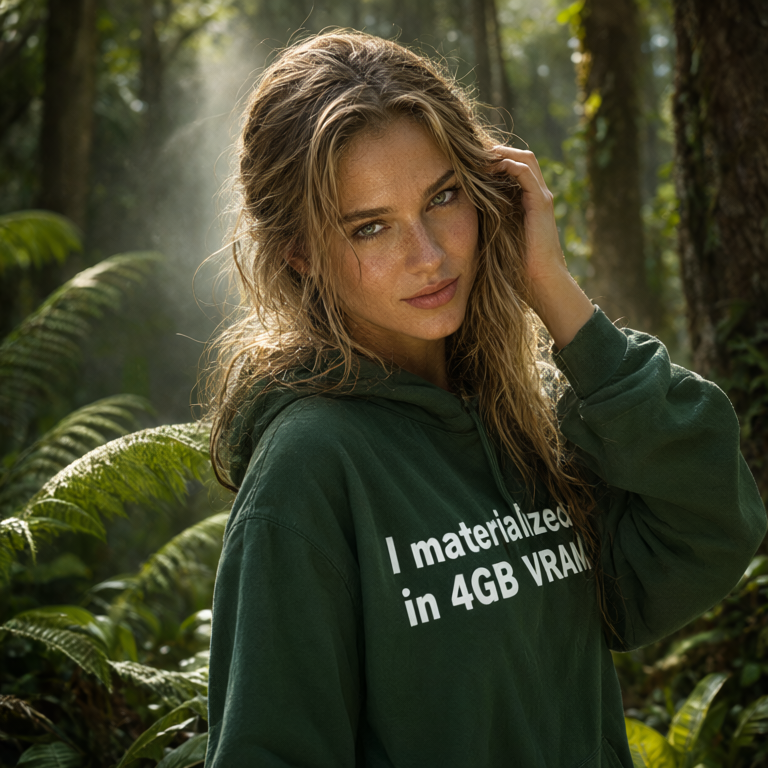
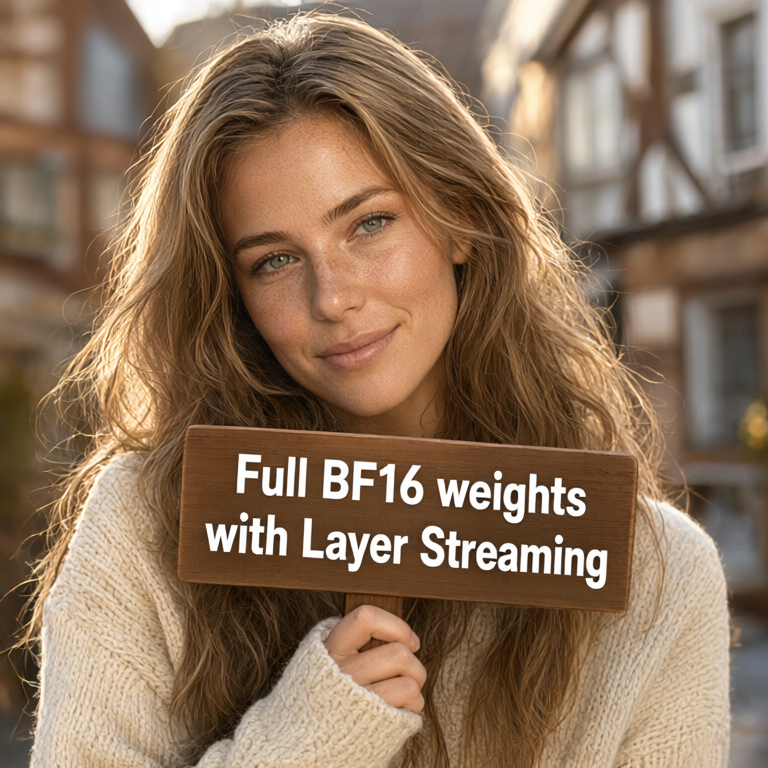

# Qwen Image 2.1

This is a Rust implementation of the [Qwen Image 2.1](https://huggingface.co/Qwen/Qwen-Image-2.1) using the Burn framework. The model currently sits at Rank 1 of [Text-to-Image Arena](https://arena.ai/leaderboard/text-to-image?license=open-source) in Open Source category as of October, 2026.

#### Sample Generations: 

<table>
  <tr>
    <td></td>
    <td></td>
    <td></td>
  </tr>
</table>

## Features
- Runs on any GPU (wgpu backend).
- Supports WebGPU.
- int8 block quantized transformer Blocks.
- Disk Layer Streaming for Low VRAM usage.

## Components
- DiT (Completed)
- VAE (Completed)
- Text Encoder (TODO)

## Flash Attention
Flash attention (used in DiT) doesn't require materializing full N x N matrix hence saving us a lot of VRAM.

## License

Code distributed under MIT license. 
 
Weights are under [qwen-research license](https://huggingface.co/Qwen/Qwen-Image-2.1/blob/main/LICENSE) and not distributed with the repo.